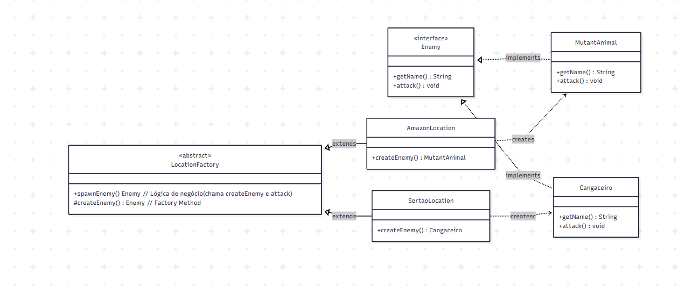

# 🧩 Padrões de Projeto Orientados a Objetos
## Prática – Padrão Factory Method (Jogo)

### 👩‍💻 Autoras
**Alexia Alves**  
**Maria Vitória Melo**

## 📘 Descrição da Questão

O exercício propôs adaptar um motor de jogo para criar inimigos específicos de diferentes localizações brasileiras — Amazônia e Sertão — aplicando o Padrão de Projeto **Factory Method**.
O objetivo principal foi garantir o desacoplamento entre o código do jogo e as classes concretas de inimigos, assegurando também que todo inimigo criado chamasse automaticamente o `método attack()` após ser instanciado.
A solução foi desenvolvida de forma extensível, permitindo que novas localizações (como Rio de Janeiro) sejam facilmente adicionadas no futuro, sem modificar o código existente.

Estrutura do problema:

- Produto Abstrato: `Enemy` (define a interface comum para todos os inimigos).

- Criador Abstrato: `LocationFactory` (define o método `spawnEnemy()` e o factory method `createEnemy()`).

- Produtos Concretos:

  - `MutantAnimal` (inimigo da Amazônia)

  - `Cangaceiro` (inimigo do Sertão)

- Criadores Concretos:

  - `AmazonLocation`

  - `SertaoLocation`

O método `spawnEnemy()` foi implementado no Criador Abstrato, garantindo que o método `attack()` seja chamado automaticamente após a criação do inimigo, centralizando a lógica de negócio.

## 🧠 Uso da Inteligência Artificial (IA)

Durante o desenvolvimento, a IA foi utilizada para definir a estrutura base do **Factory Method**, auxiliar na implementação dos produtos e criadores concretos e sugerir melhorias na simulação (`Main.java`).
Todos os prompts e respostas foram registrados e aplicados na branch master do repositório.

### 🪶 Prompt 1 – Definição do Produto e Criador Abstrato
> **Objetivo:**  Criar as interfaces e classes abstratas que sustentam o padrão.
> **Solução sugerida pela IA:**
> - Criar a interface `Enemy` com os métodos `getName()` e `attack()`.
> - Criar a classe abstrata `LocationFactory` com o método `spawnEnemy()` que utiliza o Factory Method `createEnemy()` e chama `attack()`.
>
> **Justificativa:**  
O método spawnEnemy() centraliza a lógica de criação e ataque, garantindo consistência e reduzindo acoplamento entre as classes.
>
> ✅ **Resultado:** Implementação funcional e coerente com o padrão de projeto.

### 🪶 Prompt 2 & 3 – Implementação dos Produtos e Criadores Concretos
> **Objetivo:** Criar as classes concretas de inimigos e localizações.
> **Solução sugerida pela IA:**
> - Implementar `MutantAnimal` e `Cangaceiro`, ambos derivados da interface `Enemy`.
> - Criar `AmazonLocation` e `SertaoLocation`, que estendem `LocationFactor`y e sobrescrevem o método `createEnemy()` para retornar os inimigos específicos.
>
> **Justificativa:** 
Cada fábrica é responsável por produzir apenas o tipo de inimigo adequado à sua região, mantendo a abstração do cliente.
>
> ✅ **Resultado:** A estrutura comprovou o desacoplamento entre cliente e classes concretas.

### 🪶 Prompt 4 – Configuração Final (Classe Main.java)
> **Objetivo:** Simular o funcionamento do jogo com as fábricas criadas.
> **Solução sugerida pela IA:**
> - Instanciar `AmazonLocation` e `SertaoLocation`.
> - Invocar spawnEnemy() para testar a criação e o ataque automático.
>
> **Justificativa:** 
Demonstra o comportamento dinâmico do padrão Factory Method, com o cliente interagindo apenas com o criador abstrato (LocationFactory).
>
> ✅ **Resultado:** Simulação validada com sucesso, comprovando o funcionamento correto e o baixo acoplamento do sistema.

## 🧩 Histórico de Commits Principais 
| Data       | Commit    |     Descrição |
| ---------- | ------------------------------------------------------------------------- |  
| 07/10/2025 | `4d57a32` |  Definindo Produto e Criador Abstrato (Base do Factory Method) |           
| 07/10/2025 | `0029256` |  Adicionando Produtos Concretos (Inimigos)                     |           
| 07/10/2025 | `ee0c967` |  Adicionando Criadores Concretos (Localizações/Fábricas)       |           
| 07/10/2025 | `d5f50b6` |  Adicionando `Main` para simulação e finalização               |           
| 07/10/2025 | `3590e3c` |  Adicionando o Diagrama de Classes                             |           

## Diagrama de Classes 
O diagrama abaixo representa a estrutura do padrão Factory ethod, aplicada ao sistema do jogo:

